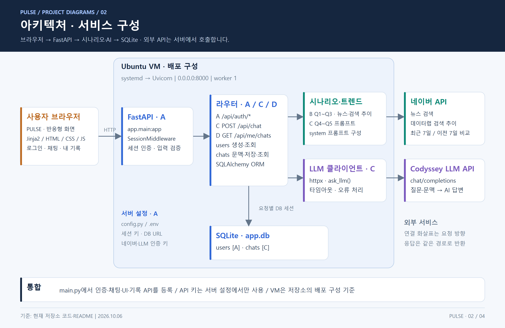
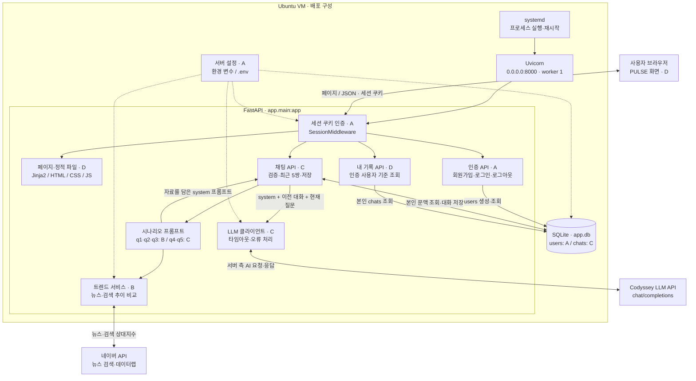
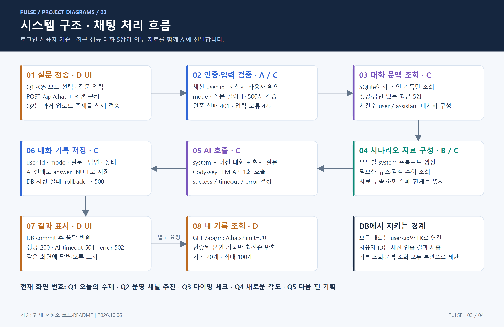
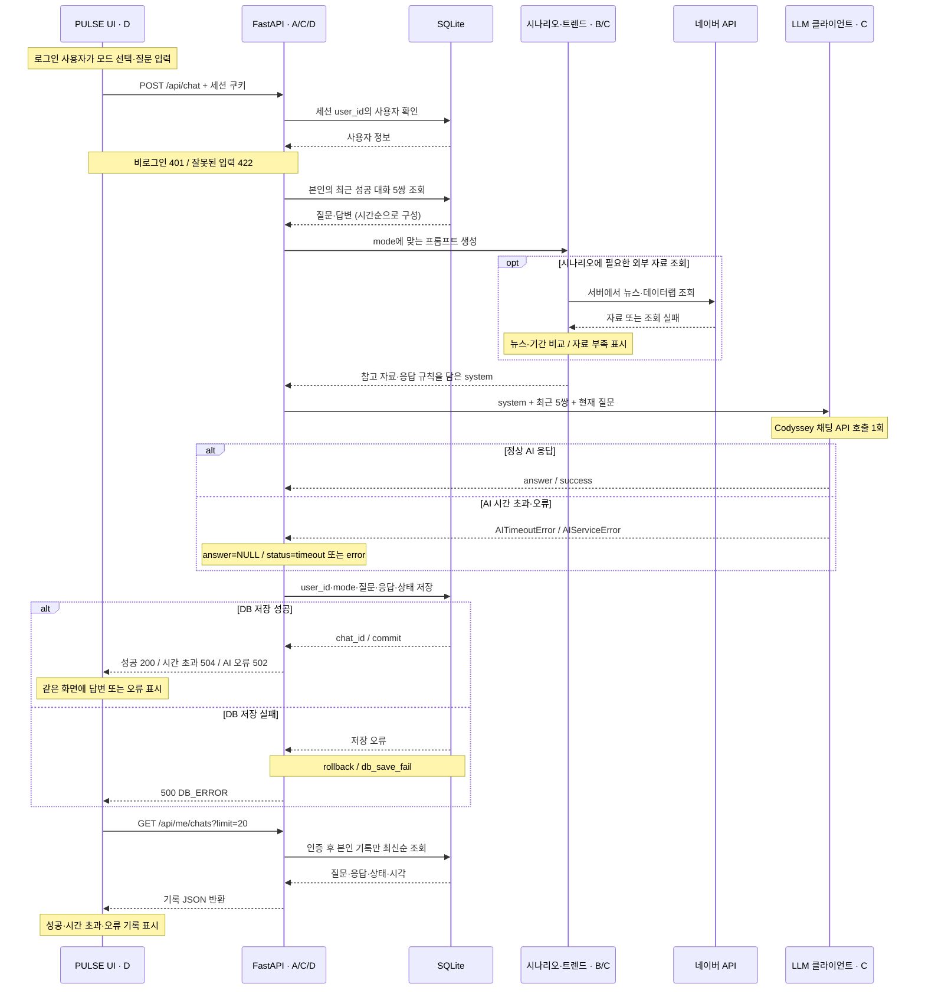
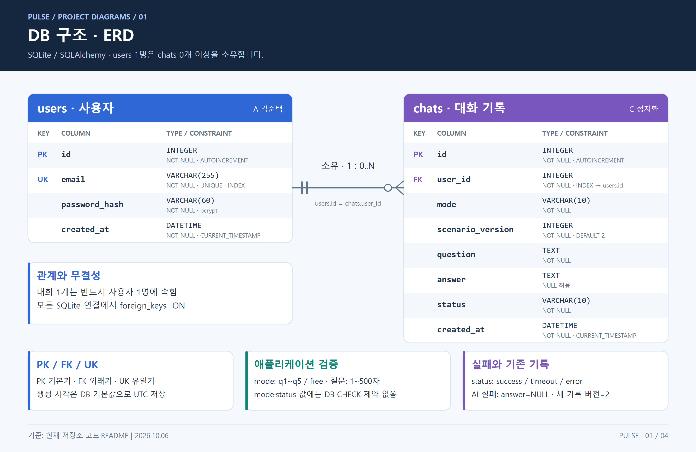
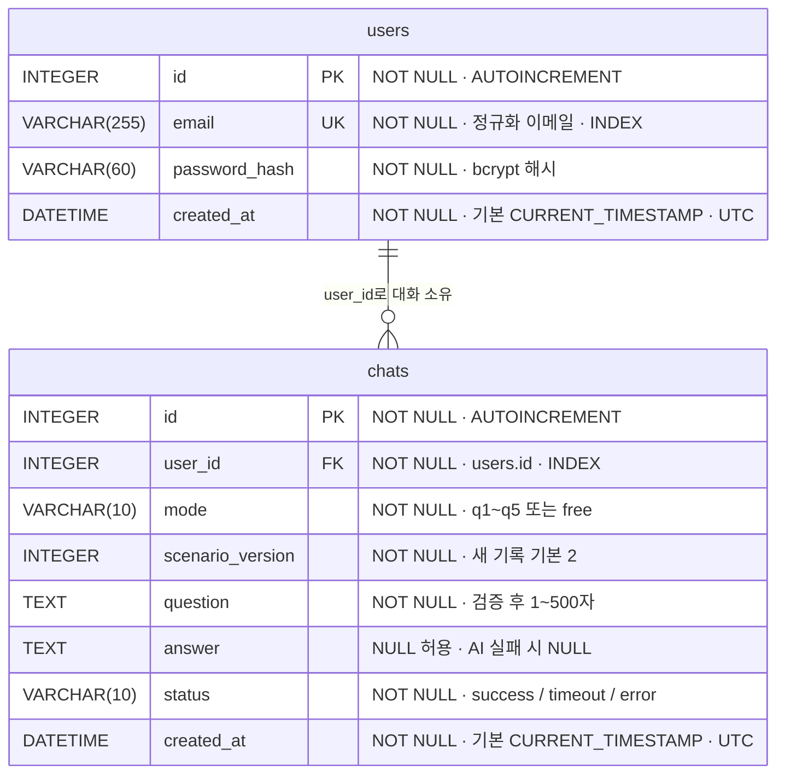
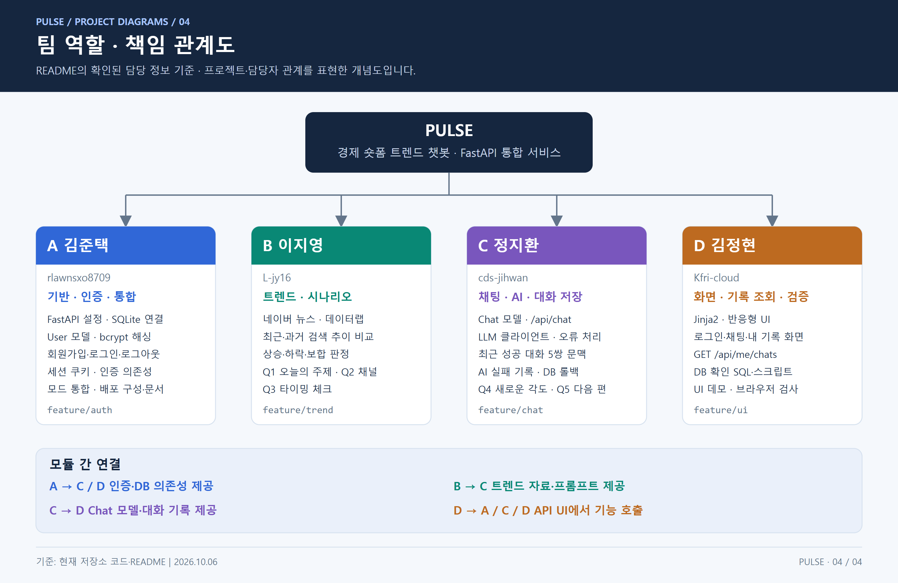
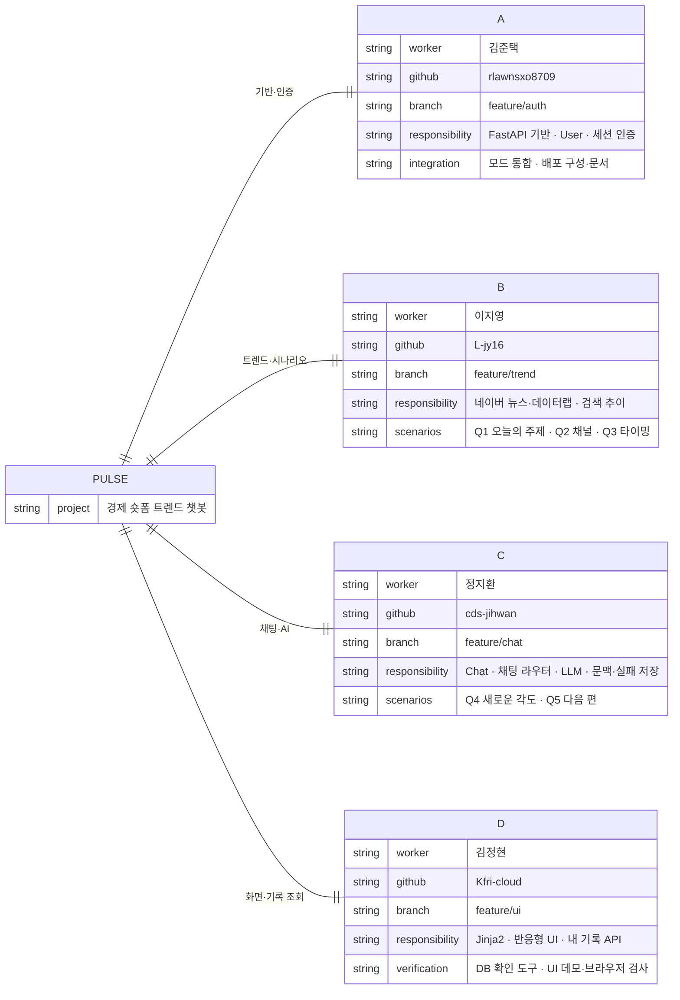

# PULSE · 경제 숏폼 트렌드 챗봇

경제·AI 숏폼 제작자를 위한 FastAPI 챗봇입니다. 회원가입·로그인 후 네이버 뉴스·검색 추이를 참고하여 AI와 기획하고, 사용자별 대화 기록을 확인합니다.

> 이 README는 현재 통합 코드와 Git 이력을 기준으로 작성했습니다. 개발 계획 PDF와 담당자별 계획·인수인계 문서는 초기 설계와 작업 이력이며, 현재 시나리오 번호·연결 상태는 아래 설명을 기준으로 확인합니다.

## 목차

- [프로젝트 개요](#프로젝트-개요)
- [기술 스택](#기술-스택)
- [현재 통합 상태](#현재-통합-상태)
- [로컬 실행](#로컬-실행)
- [배포](#배포)
- [환경 변수와 API 연결](#환경-변수와-api-연결)
- [민감정보 관리](#민감정보-관리)
- [아키텍처와 시스템 구조](#아키텍처와-시스템-구조)
- [DB 구조 · ERD](#db-구조--erd)
- [API](#api)
- [시나리오 번호와 기존 기록](#시나리오-번호와-기존-기록)
- [트렌드 판정의 한계](#트렌드-판정의-한계)
- [검증과 데모](#검증과-데모)
- [팀 구성원 역할과 개인별 작업 요약](#팀-구성원-역할과-개인별-작업-요약)
- [관련 문서](#관련-문서)

## 프로젝트 개요

- **저장소**: [L-jy16/ai_chatbot](https://github.com/L-jy16/ai_chatbot)
- **서비스 URL**: 배포 후 기입 (`http://<서버 공인 IP>:8000`, 절차는 [배포 가이드](docs/DEPLOY.md))
- **문제 정의**: AI·경제 정보가 너무 많아, 무엇이 지금 뜨는 주제이고 무엇이 이미 지난 주제인지 구분하기 어렵습니다.
- **타겟 사용자**: 유튜브 경제·AI 숏폼 제작자
- **핵심 원칙**: LLM은 오늘의 이슈를 모르므로, 서버가 네이버 뉴스 검색·데이터랩 검색 추이를 모아 프롬프트에 넣고 답하게 합니다. 자료가 없으면 지어내지 않고 한계를 밝힙니다.

**핵심 흐름**: 로그인한 사용자가 화면에서 모드를 골라 질문 → 서버가 입력을 검증하고 트렌드 자료와 최근 성공 대화 5쌍을 담아 AI를 호출 → 질문·응답·상태를 사용자별 대화 기록으로 저장 → 같은 화면에 답변 표시

**핵심 시나리오**

| 모드 | 사용자 질문 예 | 챗봇이 하는 일 |
| --- | --- | --- |
| Q1 오늘의 주제 | 오늘은 무슨 경제 숏폼을 올려야 해? | 최신 경제 뉴스와 최근/이전 검색 추이를 비교해 추천 주제·내용 정리 |
| Q2 운영 채널 추천 | 기존 영상과 연결해 오늘 올릴 주제를 추천해 줘 | 과거 업로드 주제를 확보한 뒤 관련 자료와 연결한 주제 추천 |
| Q3 타이밍 체크 | 금리 인하 주제, 지금 올려도 괜찮을까? | 검색 관심도를 비교해 지금 올리기 / 기다리기 / 다른 각도 제안 |
| Q4 새로운 각도 | AI 투자 이야기가 너무 흔해. 다른 각도 없을까? | 반전·비교·논쟁·정보·경험형 5~10개 아이디어와 최종 추천 |
| Q5 다음 편 기획 | 어제 환율 상승 영상 다음 편은 어떻게 이어갈까? | 이전 주제에서 1→2→3편 구조와 오늘 올릴 편 제안 |

## 기술 스택

| 구분 | 사용 기술 | 역할 |
| --- | --- | --- |
| 백엔드 | Python 3.10+, FastAPI, Uvicorn | 웹 페이지·API 제공, 채팅 요청 처리 |
| 인증·검증 | Starlette SessionMiddleware, bcrypt, Pydantic, email-validator | 세션 쿠키, 비밀번호 해싱, 입력 검증 |
| DB | SQLite, SQLAlchemy | 사용자와 대화 기록 저장, 사용자별 조회 |
| 프론트엔드 | Jinja2, HTML, CSS, 순수 JavaScript | 로그인·회원가입·채팅·내 기록, 반응형 화면 |
| 외부 데이터 | 네이버 뉴스 검색·데이터랩, requests | 최신 뉴스와 최근/과거 검색 상대지수 비교 |
| AI 연결 | Codyssey 게이트웨이, httpx | 서버에서 채팅 API 호출, 오류·타임아웃 처리 |
| 배포·검증 | Ubuntu VM, systemd, pytest, Playwright | 서비스 실행 관리, API·DB·브라우저 검증 |

운영 앱의 의존성 버전은 [requirements.txt](requirements.txt)에 고정되어 있습니다. UI 데모·브라우저 검사에 필요한 추가 패키지는 `requirements-ui*.txt`에 있습니다.

## 현재 통합 상태

A의 인증·SQLite, B의 트렌드, C의 채팅·AI, D의 PULSE UI를 연결했습니다. 실제 앱은 `app.main:app`이며 다섯 모드 모두 C의 채팅 라우터에서 서버 프롬프트·LLM·대화 저장 경로를 사용합니다. `dev.demo_app:app`은 외부 API를 호출하지 않는 별도의 고정 응답 데모입니다.

뉴스는 최신순 일부 검색 결과이며 인기 순위나 전체 언급량이 아닙니다. 데이터가 없거나 조회에 실패하면 실시간 사실을 지어내지 않고 한계를 알리도록 프롬프트에 명시합니다. 실제 답변 품질과 키 권한은 별도 실서비스 확인이 필요합니다.

## 로컬 실행

Python 3.10 이상. 기존 가상환경과 `.env`가 있으면 그대로 사용하며, 예제 파일로 덮어쓰지 마세요.

macOS/Linux:

```bash
python3 -m venv .venv
.venv/bin/python -m pip install -r requirements.txt
# .env가 없을 때만 실행
cp -n .env.example .env
.venv/bin/python -c "import secrets; print(secrets.token_hex(32))"
# 생성한 값을 .env의 SECRET_KEY에 넣고 나머지 API 설정을 채운 뒤 실행
.venv/bin/python -m uvicorn app.main:app --host 127.0.0.1 --port 8000
```

Windows PowerShell:

```powershell
python -m venv .venv
.\.venv\Scripts\python.exe -m pip install -r requirements.txt
# .env가 없을 때만 복사
if (-not (Test-Path -LiteralPath .env)) { Copy-Item -LiteralPath .env.example -Destination .env }
.\.venv\Scripts\python.exe -c "import secrets; print(secrets.token_hex(32))"
# 생성한 값을 .env의 SECRET_KEY에 넣고 나머지 API 설정을 채운 뒤 실행
.\.venv\Scripts\python.exe -m uvicorn app.main:app --host 127.0.0.1 --port 8000
```

1. `http://127.0.0.1:8000/signup`에서 회원가입합니다.
2. `/login`에서 로그인합니다.
3. `/`에서 Q1~Q5 중 하나를 선택해 질문합니다. Q2는 과거 업로드 주제를 먼저 입력합니다.
4. `/history`에서 사용자별 성공·실패 기록을 확인합니다.

상태 확인: `/health`. API 문서: `/docs`. `.env`를 바꾸면 서버를 재시작합니다. 서버는 기본 `app.db`에 users·chats 테이블을 생성합니다.

## 배포

VM 1대에 uvicorn + systemd로 올려 외부에서 `http://<서버 공인 IP>:8000`으로 접속합니다. 전체 절차와 문제 해결은 **[docs/DEPLOY.md](docs/DEPLOY.md)**에 있습니다. AWS EC2에 Nginx(80) 프록시로 올리는 절차(자동 스크립트 포함)는 **[docs/DEPLOY-AWS.md](docs/DEPLOY-AWS.md)**에 있습니다.

```bash
sudo apt install -y git python3 python3-venv
git clone https://github.com/L-jy16/ai_chatbot.git && cd ai_chatbot
python3 -m venv .venv && .venv/bin/pip install -r requirements.txt
cp .env.example .env && chmod 600 .env        # SECRET_KEY·API 키 입력
sudo cp deploy/ai-chatbot.service /etc/systemd/system/
sudo systemctl daemon-reload && sudo systemctl enable --now ai-chatbot
curl http://<서버 공인 IP>:8000/health         # 보안 그룹·ufw에서 TCP 8000 허용 후 확인
```

- 서비스 파일: [deploy/ai-chatbot.service](deploy/ai-chatbot.service) (`--host 0.0.0.0 --port 8000 --workers 1`, 앱이 실행 폴더의 `.env`를 읽음)
- 로그: `journalctl -u ai-chatbot -f` (요청 수신·AI 호출·AI 응답/실패·DB 저장 이벤트)
- 업데이트: `git pull` → `pip install -r requirements.txt` → `sudo systemctl restart ai-chatbot`

## 환경 변수와 API 연결

| 변수 | 설명 / 기본값 |
| --- | --- |
| `SECRET_KEY` | 필수 세션 서명 키, 16자 이상 |
| `DATABASE_URL` | `sqlite:///./app.db` |
| `NAVER_CLIENT_ID`, `NAVER_CLIENT_SECRET` | 네이버 뉴스·데이터랩용 인증 쌍 |
| `NAVER_TIMEOUT_SECONDS` | 네이버 개별 요청 제한, 기본 5초 |
| `LLM_API_KEY` | Codyssey에서 발급한 AI 키 |
| `LLM_BASE_URL` | `https://copa.codyssey.kr/v1` |
| `LLM_MODEL` | `.env.example`은 `gpt-5-mini`, 값이 비어 있어도 클라이언트가 같은 모델 사용 |
| `LLM_TIMEOUT_SECONDS` | httpx 연결·읽기·쓰기·풀 대기 타임아웃, 기본 50초; 전체 채팅 처리 시간의 상한은 아님 |

앱은 실행 폴더의 `.env`를 읽습니다. Codyssey 키로 네이버 API를 조회할 수는 없으며 두 인증은 별개입니다. AI 클라이언트는 [OpenAI Chat Completions 명세](https://developers.openai.com/api/reference/resources/chat/subresources/completions/methods/create) 형식으로 설정된 게이트웨이에 요청합니다.

`SECRET_KEY`만으로 앱을 시작할 수 있지만, 실제 AI 답변에는 `LLM_API_KEY`가 필요합니다. 네이버 인증이 없으면 트렌드 자료를 비워 두고 데이터 부족을 알리도록 프롬프트를 구성합니다. 브라우저의 채팅 대기 제한은 65초이며 트렌드 수집·AI·DB 처리를 모두 포함하므로, 브라우저 대기가 끝나도 서버에서 저장이 완료될 수 있습니다. 이때 내 기록을 먼저 확인합니다.

## 민감정보 관리

- **`.env`는 커밋하지 않습니다.** `.gitignore`가 `.env`, `.env.*`(단 `.env.example` 제외), `.venv/`, `*.db`를 제외합니다. 저장소에는 변수 이름과 기본값만 있는 [`.env.example`](.env.example)을 둡니다. 새 키가 생기면 `.env.example`에 이름만 추가합니다.
- **API 키는 서버에서만 씁니다.** LLM·네이버 호출은 모두 서버에서 하고, 브라우저는 같은 출처의 `/api/*`만 호출합니다. `/api/me`는 키 값이 아니라 설정 여부(`true`/`false`)만 알려 줍니다.
- **비밀번호는 bcrypt 해시로만 저장합니다.** 서버 로그에는 비밀번호·해시·API 키·AI 서비스의 원본 오류 본문을 남기지 않고, 로그인 실패 로그에는 형식이 올바른 이메일만 남깁니다.
- **세션 쿠키**는 `SECRET_KEY`로 서명되고 `httponly`·`SameSite=Lax`입니다. `SECRET_KEY`가 없거나 16자 미만이면 서버가 시작되지 않습니다.
- D 페이지는 CSP와 `textContent`로 질문·답변의 HTML 실행을 막습니다.
- 테스트는 외부 API 키를 빈 값으로 고정해 실제 유료 API를 호출하지 않습니다.
- 서버의 `.env`는 `chmod 600`으로 두고, 키가 노출되면 즉시 재발급한 뒤 `.env`만 바꿔 재시작합니다.

## 아키텍처와 시스템 구조

현재 통합 코드 기준으로 서비스 구성과 채팅 처리 흐름을 이미지로 정리했습니다. DB 구조는 [ERD](#db-구조--erd), 담당자별 책임은 [팀 역할 관계도](#팀-구성원-역할과-개인별-작업-요약)에서 확인할 수 있습니다. 이미지의 A~D는 팀 역할을 나타내며, 각 이미지 아래에 확대 가능한 SVG와 Mermaid 원본을 제공합니다.

### 서비스 아키텍처



[PNG 크게 보기](docs/images/diagrams/02-architecture.png) · [SVG 원본](docs/images/diagrams/02-architecture.svg)

<details>
<summary>서비스 아키텍처 Mermaid 원본</summary>



</details>

VM은 저장소에 제공된 배포 구성입니다. 실제 배포 주소와 외부 접속 성공 여부는 별도로 확인해야 합니다. API 키는 서버 설정에서만 읽으며, 브라우저는 같은 출처의 앱 API를 호출합니다. `free` 모드는 트렌드 조회 없이 기본 프롬프트를 사용합니다.

### 채팅 처리와 시스템 연결



[PNG 크게 보기](docs/images/diagrams/03-system-flow.png) · [SVG 원본](docs/images/diagrams/03-system-flow.svg)

<details>
<summary>채팅 처리 시퀀스 Mermaid 원본</summary>



</details>

트렌드 조회 실패는 빈 뉴스·`unknown` 비교 결과로 처리합니다. AI 시간 초과·오류도 DB 저장에 성공하면 실패 기록으로 남으며, 저장 자체가 실패하면 `DB_ERROR`가 우선 반환됩니다.

### 파일 구조

```text
app/
├── main.py, config.py, database.py       # 기반·설정·DB
├── dependencies.py, errors.py, security.py
├── models/user.py, chat.py              # 사용자·대화
├── routers/auth.py, chat.py             # 인증·AI 요청
├── routers/pages.py, logs.py            # D 페이지·기록 조회
├── services/trend.py, llm.py            # 네이버·AI
├── services/scenarios/                  # 모드별 프롬프트 (모드↔파일 대응: docs/SCENARIOS.md)
├── ui.py                               # 페이지·static·기록 라우터 등록
├── templates/                          # D Jinja2 템플릿
└── static/css/, static/js/              # D UI

deploy/ai-chatbot.service                # VM 프로세스 관리
dev/                                    # 별도 UI 데모·브라우저 검사
docs/                                   # 시나리오 계약·설계·배포·인수인계
docs/images/diagrams/                   # README 다이어그램 PNG·SVG
PDF/                                    # 개발 계획·과제 원문
scripts/                                # 실제 API 연결·읽기 전용 DB 확인
tests/                                  # 인증·트렌드·AI·DB·UI 테스트
.env.example                            # 환경 변수 설정 예시
requirements.txt                        # 운영·테스트 의존성
```

`main.py`는 A 인증 라우터와 C의 `create_router(require_login, get_db)`를 등록하고 `install_ui(..., chat_model=Chat)`를 한 번 호출합니다. `/static`, `/`, `/api/me/chats`는 D 등록만 사용하여 중복 경로를 피합니다. 이전 임시 단일 HTML 화면은 제거했습니다.

사용자별 최근 **성공 대화 5쌍**을 시간순으로 AI에 전달합니다. 네이버의 동기 HTTP 호출은 `asyncio.to_thread()`로 분리하고, 가능한 조회는 `asyncio.gather()`로 병렬 실행합니다. 네이버 개별 요청에 타임아웃을 설정하며 전체 트렌드 수집 시간에 대한 별도 제한은 없습니다. 요청 수신, AI 시작·성공/실패, DB 저장 성공/실패를 기록합니다. 질문·키·AI 서비스의 원본 오류 본문은 로그에 넣지 않습니다.

## DB 구조 · ERD

기본 DB는 `sqlite:///./app.db`입니다. 아래 ERD는 [User 모델](app/models/user.py)과 [Chat 모델](app/models/chat.py)의 실제 컬럼을 표현합니다. 사용자 한 명은 대화가 없거나 여러 개일 수 있고, 대화 한 개는 반드시 사용자 한 명에 속합니다.



[PNG 크게 보기](docs/images/diagrams/01-db-erd.png) · [SVG 원본](docs/images/diagrams/01-db-erd.svg)

<details>
<summary>DB ERD Mermaid 원본</summary>



</details>

| 설계 항목 | 실제 동작 |
| --- | --- |
| 사용자 식별 | 요청 본문의 사용자 ID 대신 세션 인증 결과의 `user.id`를 사용 |
| 이메일 | NFKC 정규화·공백 제거·소문자 변환 후 저장, UNIQUE로 중복 방지 |
| 외래키 | `chats.user_id → users.id`, SQLite 연결마다 `PRAGMA foreign_keys=ON` 적용 |
| 인덱스 | `users.email`과 `chats.user_id`에 인덱스 지정 |
| 대화 문맥 | 같은 사용자의 `success`이며 답변이 NULL이 아닌 최근 5개 행을 조회 |
| 기록 정렬 | `created_at DESC, id DESC`, 기본 20개·최대 100개 |
| 실패 기록 | AI 실패 시 `answer=NULL`, `status=timeout` 또는 `error`; DB 저장 실패는 rollback |
| 시나리오 호환 | 새 기록 `scenario_version=2`, 구 기록의 번호는 조회 시 현재 화면 번호로 변환 |
| 생성 시각 | DB 기본 `CURRENT_TIMESTAMP`로 UTC 저장, 화면의 offset 없는 시각은 `(서버 시각)` 표시 |

앱 시작 시 모델을 등록하고 테이블을 생성합니다. 기존 `chats`에 `scenario_version`이 없으면 기본 1로 컬럼을 추가합니다. `mode`와 `status`의 값 제한은 애플리케이션 로직으로 처리하며 DB CHECK 제약은 없습니다. 채널 업로드 맥락은 질문에 포함해 저장합니다.

## API

| 메서드 | 경로 | 로그인 | 설명 / 성공 상태 |
| --- | --- | --- | --- |
| POST | `/api/auth/signup` | 불필요 | 회원가입, 201 |
| POST | `/api/auth/login` | 불필요 | 로그인·세션 쿠키, 200 |
| POST | `/api/auth/logout` | 필요 | 세션 삭제, 204·본문 없음 |
| GET | `/api/me` | 필요 | 내 사용자 정보·API 설정 여부, 키 값 제외, 200 |
| POST | `/api/chat` | 필요 | q1~q5 또는 free 질문·AI 응답·저장, 200 |
| GET | `/api/me/chats?limit=20` | 필요 | 내 기록만 최신순, 1~100개, no-store, 200 |
| GET | `/health` | 불필요 | 서버 상태 `{"status":"ok"}`, 200 |

화면 경로는 `/signup`, `/login`, `/`(채팅), `/history`(내 기록)이며, 비로그인 사용자의 채팅·기록 페이지 접근은 `/login`으로 303 리다이렉트합니다. API 문서는 `/docs`에서 확인합니다.

### 회원가입·로그인

두 API의 요청 형식은 같습니다. 아래 이메일·비밀번호는 요청 예시입니다.

```json
{"email":"creator@example.com","password":"shorts1234"}
```

성공 응답(회원가입 201 / 로그인 200):

```json
{"id":1,"email":"creator@example.com"}
```

회원가입은 이메일 형식·중복과 비밀번호 8자 이상·UTF-8 72바이트 이하를 검사합니다. 가입 후 로그인은 별도로 수행합니다. 로그인 성공 시 `session` 쿠키를 발급하며 이후 요청에도 같은 쿠키를 전달해야 합니다.

### 채팅

요청:

```json
{"mode":"q3","message":"금리 인하 주제 지금 올려도 돼?","keyword":"금리 인하"}
```

`keyword`는 API에서 선택적으로 지정할 수 있습니다. UI는 질문에서 키워드를 추출하는 기본 경로를 사용합니다. Q2 UI는 `최근 업로드 주제: ...\n질문: ...`를 한 message로 전송하며 전체 500자 제한을 적용합니다. API에서 맥락 없이 Q2를 호출하면 먼저 과거 업로드 주제를 물어보도록 지시합니다.

`mode`는 `q1`~`q5` 또는 API 전용 `free`를 받습니다. `message`는 앞뒤 공백을 제거한 뒤 1~500자, 선택 `keyword`는 50자 이하입니다. UI에 자유 질문 버튼은 없습니다.

성공 응답(200, DB 저장 완료 후 반환):

```json
{"chat_id":1,"answer":"추천 주제와 기획 내용"}
```

### 내 대화 기록

로그인 쿠키를 포함해 `GET /api/me/chats?limit=20`을 호출합니다. 조회 대상은 인증된 본인으로 고정되며 다른 사용자의 ID를 지정해 기록을 조회할 수 없습니다.

응답 예시(200):

```json
[
  {
    "id": 2,
    "mode": "q3",
    "question": "금리 인하 주제 지금 올려도 돼?",
    "answer": null,
    "status": "timeout",
    "created_at": "2026-10-06T00:10:00"
  },
  {
    "id": 1,
    "mode": "q1",
    "question": "오늘 올릴 경제 숏폼 주제를 추천해 줘.",
    "answer": "추천 주제와 기획 내용",
    "status": "success",
    "created_at": "2026-10-06T00:00:00"
  }
]
```

기록이 없으면 `[]`를 반환합니다. `user_id`, `scenario_version`, 비밀번호 해시는 기록 응답에 포함하지 않습니다.

### 오류 처리

| HTTP | 오류 코드 | 상황 |
| --- | --- | --- |
| 401 | `LOGIN_REQUIRED` | 인증이 필요한 API의 비로그인 요청 |
| 401 | `INVALID_CREDENTIALS` | 이메일·비밀번호 불일치 |
| 409 | `EMAIL_TAKEN` | 가입 이메일 중복 |
| 422 | `INVALID_INPUT` | 빈 입력·길이·타입·mode·이메일 검증 실패 |
| 502 | `AI_ERROR` | AI 설정 누락·호출 실패·잘못되거나 빈 응답 |
| 504 | `AI_TIMEOUT` | AI 클라이언트의 요청 타임아웃 |
| 500 | `DB_ERROR` | 대화 저장 실패, rollback |
| 503 | 문자열 `detail` | 기록 조회 DB 실패 |

AI 타임아웃 응답 예시:

```json
{"error":"AI_TIMEOUT","message":"현재 응답이 지연되고 있어요. 잠시 후 다시 시도해 주세요."}
```

시간 초과·AI 오류도 DB 저장에 성공하면 `answer=null`로 기록합니다. 기록 조회 DB 오류는 `{"detail":"기록을 불러오지 못했습니다. 잠시 후 다시 시도해 주세요."}` 형식입니다.

## 시나리오 번호와 기존 기록

현재 계약은 [docs/SCENARIOS.md](docs/SCENARIOS.md)의 Q1~Q5입니다. **이전 API의 q4 타이밍 호출은 q3로 바꾸세요.** 새 q4는 새로운 각도입니다.

`chats.scenario_version`으로 기록의 번호 체계를 구분합니다. 서버 시작 시 기존 chats 테이블에 해당 열이 없으면 기본 1로 추가하며, 원래 mode·질문·답변은 그대로 보존합니다. 새 기록은 버전 2(화면 Q1~Q5 번호)입니다. 기록 API는 계획서 번호로 저장된 버전 1과 버전 3(C 통합 중 사용)의 q4/q5/q6를 화면 q3/q4/q5로 변환하여 응답합니다. API 응답 필드 수는 기존 계약과 같습니다. SQL에서 원본 mode를 볼 때는 scenario_version도 함께 확인하세요. 스키마 변경은 반복 실행해도 열을 중복 추가하지 않습니다.

users와 chats는 user_id로 연결됩니다. DB 생성 시각은 UTC이며 D 화면은 offset 없는 시각을 `(서버 시각)`으로 표시합니다.

## 트렌드 판정의 한계

한국 시간 어제까지 완료된 14일을 한 번에 조회하여 같은 척도로 비교합니다. 최근 7일 평균이 이전 7일보다 20% 이상 높으면 rising, 20% 이상 낮으면 falling입니다. 그 사이에서 상대지수가 80 이상이면 peak(정점 후보), 나머지는 stable(보합)입니다. 실제 정점을 확정하는 통계 모델은 아닙니다.

빈 응답·14일 데이터 누락·전 기간 0은 unknown, available=false, 평균 null입니다. 검색 상대지수는 조회수나 실제 검색 횟수가 아닙니다.

## 검증과 데모

```bash
.venv/bin/python -m pytest -q
.venv/bin/python -m pip check
```

테스트는 임시 DB와 모의 외부 응답을 사용하며 실제 유료 API를 호출하지 않습니다. 기존 인증·UI 테스트에 다섯 모드 분기·프롬프트·대화 저장·사용자 격리·오류·구 기록 호환 검사를 포함합니다.

실제 연결 확인은 아래 명령으로 별도 수행할 수 있습니다. **실제 API 사용량이 발생할 수 있습니다.** 임시 DB에서 가입→로그인→Q3 실제 AI 호출→기록을 확인하며 운영 app.db는 수정하지 않습니다.

```bash
.venv/bin/python -m scripts.check_connection
```

UI 전용 데모:

```bash
.venv/bin/python -m pip install -r requirements-ui-dev.txt
.venv/bin/python -m uvicorn dev.demo_app:app --host 127.0.0.1 --port 8001
```

데모 계정은 `demo@example.com` / `demo-pass-2026`입니다. 실제 계정이 아니며 예시 응답과 메모리 DB만 제공합니다. 데모 가입은 503, `[timeout]`·`[error]`는 데모 전용 실패 시뮬레이션입니다. 실제 앱 대신 데모를 운영하지 마세요.

브라우저 검사 도구: `requirements-ui-browser.txt`, `dev/check_ui_browser.py`, `dev/check_auth_browser.py`. `check_ui_browser.py`는 실행 중인 UI 데모를 대상으로 합니다. `check_auth_browser.py`는 채팅·기록 연결 전의 준비 중 화면을 전제로 작성되어 현재 통합 앱의 검증에 그대로 사용할 수 없습니다. D 작업 이력은 [D_HANDOFF.md](docs/D_HANDOFF.md)에 있습니다.

DB 읽기 전용 검사:

```bash
.venv/bin/python scripts/check_logs.py --db app.db --user-id 1 --limit 20
```

SQLite CLI 예시는 `scripts/check_logs.sql`을 참고하세요. 존재하지 않는 DB는 새로 만들지 않습니다.

## 팀 구성원 역할과 개인별 작업 요약

### 팀 역할 관계도

프로젝트와 작업자의 책임 관계, 모듈 간 연결을 정리한 개념도입니다. 실제 DB 테이블 구조는 앞의 `users`·`chats` ERD를 참고합니다. 시나리오 번호는 현재 화면의 Q1~Q5 기준입니다.



[PNG 크게 보기](docs/images/diagrams/04-team-roles.png) · [SVG 원본](docs/images/diagrams/04-team-roles.svg)

<details>
<summary>팀 역할 개념 ERD Mermaid 원본</summary>



</details>

### 개인별 작업 요약

작업자 이름·GitHub 계정은 팀에서 확인한 정보이며, 요약은 소유 파일과 저장소 Git 이력을 대조했습니다. C의 커밋 작성자 이름은 `Jipang`, D는 `Kfri`로 표시됩니다. 계획서의 배포·문서 담당과 실제 통합 기여를 구분해, A가 작성한 배포 구성·문서도 함께 기록합니다.

| 역할 | 작업자(깃네임) | 브랜치 · PR | 개인별 작업 요약 |
| --- | --- | --- | --- |
| A | **김준태** ([rlawnsxo8709](https://github.com/rlawnsxo8709)) | `feature/auth` (#2), 통합 (#3), 배포 문서 (#6) | FastAPI 골격(설정·SQLite 연결·공통 에러 형식·로깅), User 모델과 bcrypt 해싱, 회원가입·로그인·로그아웃(세션 쿠키), `require_login`·`get_current_user` 의존성, 가입 입력 검증과 보안 보강(72바이트 비밀번호, 유니코드 이메일 정규화, 로그 마스킹), 인증 테스트와 공용 테스트 fixture. 통합: 화면 Q1~Q5와 시나리오 연결, LLM 응답 토큰·타임아웃 조정, systemd 서비스 파일·배포 가이드·README |
| B | **이지영** ([L-jy16](https://github.com/L-jy16)) | `feature/trend` (#5) | 네이버 API 클라이언트, 뉴스 검색·오늘의 경제 이슈, 데이터랩 검색 추이 조회·최근/과거 비교·상승/하락 판정, Q1 오늘의 주제·Q2 운영 채널 추천·Q3 타이밍 체크 프롬프트, 인증·트렌드·AI·D 화면 1차 연결 |
| C | **정지환** ([cds-jihwan](https://github.com/cds-jihwan)) | `feature/chat` (#3) | 코디세이 LLM 클라이언트(타임아웃·오류 처리), Chat 모델, `POST /api/chat`(입력 검증·최근 5쌍 문맥·모드 분기), 요청·AI·DB 이벤트 로깅, AI 실패 기록과 DB 롤백, Q4 새로운 각도·Q5 다음 편 프롬프트(`scenarios/q5.py`·`q6.py`), 채팅 API 테스트 |
| D | **김정현** ([Kfri-cloud](https://github.com/Kfri-cloud)) | `feature/ui` (#4) | 공통 템플릿·반응형 스타일, 로그인·회원가입·채팅·내 기록 화면, 모드 선택·예시 질문, 대기·오류·세션 만료 안내, 사용자별 기록 API `GET /api/me/chats`, DB 확인 SQL·스크립트, 독립 데모 앱, 브라우저 검사 |

주요 연결은 A의 `require_login`·`get_db` → C 채팅·D 기록 API, B의 트렌드·프롬프트 → C의 LLM 호출, C의 `Chat` → D의 기록 조회입니다. D 화면은 A 인증·C 채팅·D 기록 API를 호출하며 `main.py`가 실제 모듈을 한 앱으로 등록합니다.

**통합 과정**: B의 PR #5가 인증·트렌드·AI·D 화면을 처음 연결했습니다. 이후 C의 PR #3에서 채팅 라우터·Chat 모델·LLM 클라이언트를 C의 구현을 기준으로 하나로 합치고, 화면 Q1~Q5 번호와 담당 시나리오를 맞췄습니다(대응표: [docs/SCENARIOS.md](docs/SCENARIOS.md)).

팀 정책은 feature/* → develop → main, PR 리뷰 후 merge commit입니다. 로컬 테스트 성공만으로 완료 표시하지 않고, 실제 API 응답과 배포 후 외부 접속을 따로 확인합니다.

## 관련 문서

| 문서 | 내용 |
| --- | --- |
| [핵심 평가 질문·답안 30선](docs/EVALUATION_PRIORITY_QA.md) | 제공된 평가 기준 30개에 대한 우선 질문·답안, 코드 근거, 현장 시연 순서 |
| [예상 질문 100선](docs/EXPECTED_QUESTIONS_100.md) | 평가 기준 우선 30문항과 설계·보안·DB·AI·운영·개인 기여 심화 70문항 |
| [답안 100선](docs/EXPECTED_ANSWERS_100.md) | 동일 문항 번호의 답안·근거 파일·시연 방법, 구현과 개선 과제 구분 |
| [다이어그램 전체 미리보기](docs/images/diagrams/00-overview.png) | DB ERD·아키텍처·시스템 처리 흐름·팀 역할 이미지 4장 |
| [다이어그램 원본 안내](docs/images/diagrams/README.md) | PNG·SVG 파일, 작성 기준과 이미지 재생성 방법 |
| [개발 계획 PDF](<PDF/7-1경제 숏폼 트렌드 챗봇 팀 개발 계획.pdf>) | 최초 범위·시스템 설계·A~D 분담·협업 규칙 |
| [과제 원문](<PDF/미션 - AI 도구 학습 (1).pdf>) | 서비스·문서·로그·배포·협업 요구사항 |
| [SCENARIOS.md](docs/SCENARIOS.md) | 현재 Q1~Q5 계약, 화면과 프롬프트 파일 대응 |
| [DEPLOY.md](docs/DEPLOY.md) | Ubuntu VM 설치·systemd·외부 접속·운영 절차 |
| [DEPLOY-AWS.md](docs/DEPLOY-AWS.md) | AWS EC2 배포(Nginx 80 → uvicorn 127.0.0.1:8000, 보안 그룹 80·22만)·비용·정리 절차 |
| [auth-design.md](docs/auth-design.md) | A 인증·설정·DB 설계와 개발 당시 계약 |
| [C_PLAN.md](docs/C_PLAN.md), [C_AGENT_HANDOFF.md](docs/C_AGENT_HANDOFF.md) | C 개발 계획·연동 계약·작업 당시 확인 범위 |
| [D_HANDOFF.md](docs/D_HANDOFF.md), [D_PR_DRAFTS.md](docs/D_PR_DRAFTS.md) | D 화면·기록 API·데모·검증 이력 |

담당자 문서에는 개발 당시의 모드 번호·타임아웃·통합 대기 상태가 남아 있습니다. 현재 동작은 이 README와 실제 코드로 확인합니다.
