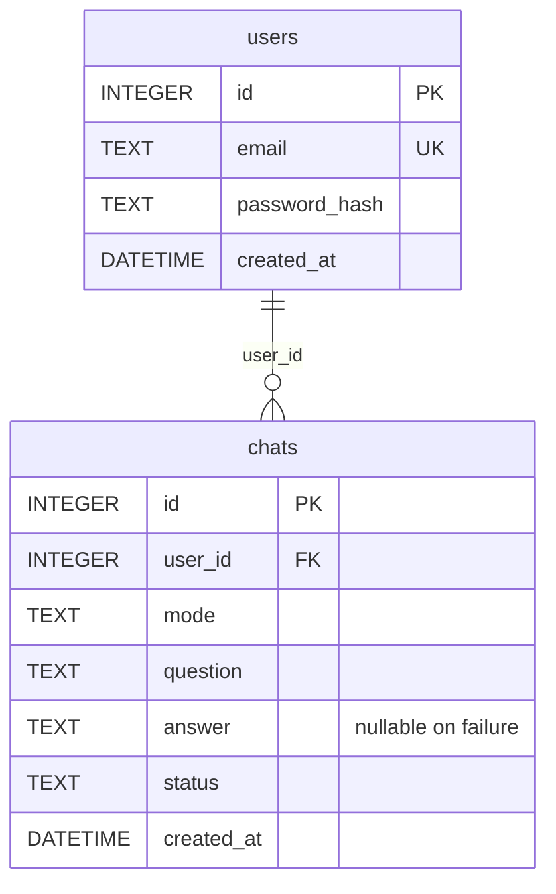

# PULSE · 경제 숏폼 트렌드 챗봇

유튜브 경제·AI 숏폼 제작자가 오늘의 주제, 게시 타이밍, 새로운 관점, 후속 시리즈를 질문하는 FastAPI 서비스입니다. 최근·과거 트렌드 데이터를 서버의 LLM 프롬프트에 넣는 구조를 목표로 합니다.

**현재 상태:** `feature/ui`에서 D의 UI·로그 조회·SQL·문서를 구현했습니다. 시작 시 저장소에는 README와 참고 PDF만 있었습니다. A의 기반·인증, B의 네이버 데이터, C의 실제 AI·대화 저장은 아직 이 저장소에 없어 독립 데모로 D를 검증합니다. 실제 회원가입·AI·영구 DB 통합은 대기 상태입니다. **배포는 사용자 요청으로 제외했습니다.**

## D 구현 범위

| 항목 | 파일 / 동작 |
| --- | --- |
| 공통 템플릿·반응형 스타일 | `app/templates/base.html`, `app/static/css/style.css` |
| 로그인·회원가입 | `login.html`, `signup.html`, `static/js/auth.js` |
| 채팅·같은 화면 응답 | `chat.html`, `static/js/chat.js` |
| Q1~Q5·예시 질문 | `static/js/modes.js` |
| 대기·오류·입력 검증 | 빈 값·500자 제한, 중복 전송 차단, 실패 시 입력 유지·재로그인 안내 |
| 내 기록 API | `app/routers/logs.py`, 인증 사용자별 최신순 조회 |
| 내 기록 화면 | `history.html`, `static/js/history.js` |
| DB 확인 SQL·스크립트 | `scripts/check_logs.sql`, `scripts/check_logs.py` |
| 팀 코드 연결 | `app/ui.py`의 `install_ui()` |
| 문서 | 이 README, `docs/D_HANDOFF.md`, `docs/D_PR_DRAFTS.md` |

## 로컬 미리보기 실행

Python 3.10 이상. 기존 가상환경이 있으면 재사용하세요.

Windows PowerShell:

```powershell
python -m venv .venv
./.venv/Scripts/python.exe -m pip install -r requirements-ui-dev.txt
./.venv/Scripts/python.exe -m uvicorn dev.demo_app:app --host 127.0.0.1 --port 8000
```

Linux/macOS:

```bash
python3 -m venv .venv
.venv/bin/python -m pip install -r requirements-ui-dev.txt
.venv/bin/python -m uvicorn dev.demo_app:app --host 127.0.0.1 --port 8000
```

접속: `http://127.0.0.1:8000/login`

| 공개 테스트 계정 | 값 |
| --- | --- |
| 이메일 | `demo@example.com` |
| 비밀번호 | `demo-pass-2026` |

이 계정은 실제 계정·비밀키가 아닙니다. 데모는 고정 예시 응답, 메모리 SQLite, 예시 로그인만 제공합니다. 회원가입 화면은 있지만 데모 가입 API는 503과 미연결 안내를 반환합니다. DB는 재시작하면 초기화되며 쿠키명은 `pulse_demo_session`입니다. 상단 배너에서 뉴스·AI 미연결 상태를 확인할 수 있습니다. `dev/demo_app.py`를 운영 앱으로 사용하지 마세요.

확인 순서:

1. 회원가입 화면의 이메일·비밀번호 확인을 살펴봅니다. 실제 가입은 A 연결 후 검사합니다.
2. 예시 계정으로 로그인하고 다섯 가지 모드를 선택해 질문합니다. Q2에서는 과거 업로드 주제를 먼저 입력합니다.
3. 같은 화면에서 응답을 확인합니다.
4. `[timeout]`, `[error]`를 질문으로 정확히 입력해 실패 안내·입력 유지·재시도를 확인합니다. 데모 전용 테스트 문자열입니다.
5. 내 기록에서 질문·응답·시각·성공/실패 상태를 확인합니다.
6. 로그아웃 후 `/`, `/history`, `/api/me/chats` 접근 차단을 확인합니다.

## 구조와 담당

```text
브라우저: Jinja2 + CSS + 순수 JS [D]
  ├─ /api/auth/* → 세션 인증 [A]
  ├─ /api/chat → 시나리오·트렌드 [B/C] → 서버 LLM [C] → chats 저장 [C]
  └─ /api/me/chats → 인증 [A] → 사용자별 chats 조회 [D]
                                   └─ SQLite 연결 [A]
```

```text
app/
├── main.py, config.py, database.py     # A: 통합 시 추가
├── models/user.py                     # A: 통합 시 추가
├── models/chat.py                     # C: 통합 시 추가
├── routers/
│   ├── auth.py, chat.py                # A/C: 통합 시 추가
│   ├── pages.py                       # D
│   └── logs.py                        # D
├── services/                          # B/C: 통합 시 추가
├── ui.py                              # D: 등록 도우미
├── templates/                         # D: 5개 템플릿
└── static/css/, static/js/             # D
dev/demo_app.py                        # 실제 앱과 분리한 데모
dev/check_ui_browser.py                # 선택적 브라우저 검사
scripts/check_logs.sql, check_logs.py   # D: 읽기 전용 검사
tests/test_ui.py                       # D: API·SQL 검사
```

## A·C 코드에 연결

FastAPI 앱, SessionMiddleware, `require_login`, 동기 SQLAlchemy `get_db`, C의 `Chat` 모델이 준비되면 A의 `main.py`에 한 번 등록합니다. 아래 import는 팀 코드에 맞춰 조정합니다.

```python
# A/C가 구현할 모듈입니다. 현재 데모로 대체하지 않습니다.
from app.database import get_db
from app.models.chat import Chat
from app.routers.auth import require_login
from app.ui import install_ui

# A가 생성하고 SessionMiddleware를 설정한 app에 등록
install_ui(app, require_login=require_login, get_db=get_db, chat_model=Chat)
```

`install_ui()`가 `/static`, 페이지, 로그 API를 등록합니다. 중복 등록은 오류로 알립니다. 실제 앱은 통합 후 `app.main:app`으로 실행합니다.

팀과 합의할 추가 계약:

- 최신 mode는 q1~q5입니다. Q2에서는 최근 업로드 주제를 먼저 입력받아 `최근 업로드 주제: ...\n질문: ...` 형태의 message로 전달하며 전체 500자 제한을 검사합니다. 기존 q4/q5/q6 의미와 달라 C의 검증·분기도 함께 맞춰야 합니다. 기존 번호로 저장된 기록은 팀이 변환 범위를 확인합니다.

- 로그인 시 A는 `request.session["user_id"]`에 양의 **정수 ID**를 저장하고 로그아웃 시 세션을 지웁니다.
- `require_login`은 비로그인을 401로 차단하고 정수 ID·`User.id`·`{"id": 정수}` 중 하나를 반환합니다. 삭제된 사용자·만료 계정은 A에서 검사합니다.
- `get_db()`는 **동기 SQLAlchemy Session**을 yield하고 닫습니다. AsyncSession은 현재 로그 라우터와 호환되지 않습니다.
- C의 `Chat`은 `id`, `user_id`, `mode`, `question`, nullable `answer`, `status`, `created_at` 속성을 갖습니다.
- 인증 요청은 JSON `{email, password}`로 합의합니다. 로그인은 200 및 세션 쿠키, 가입은 200/201 후 로그인 화면으로 이동합니다. 가입 직후 세션 발급 방식도 페이지 리다이렉트로 동작합니다.
- 가입 화면은 비밀번호 8~128자를 검사합니다. 최종 정책과 서버 검증은 A가 결정하고 화면과 맞춥니다. 클라이언트 검증은 서버 검증을 대신하지 않습니다.
- C의 AI timeout은 브라우저 제한 65초보다 짧게 설정합니다. 브라우저 연결이 끊겨도 서버가 저장할 수 있어 시간 초과 안내는 내 기록 확인을 요청합니다.
- API 오류는 `{error, message}`를 우선 사용합니다. 문자열 `detail`과 FastAPI 검증 오류 배열도 표시합니다.

## API 명세

인증·채팅은 A/C의 **팀 계약**입니다. 데모 대체 동작과 구분합니다. 내 기록 API는 D의 실제 구현입니다.

| 메서드 | 경로 | 인증 | 설명 / 담당 |
| --- | --- | --- | --- |
| POST | `/api/auth/signup` | X | 가입 A, 화면 D / 데모는 503 |
| POST | `/api/auth/login` | X | 세션 발급 A / 데모 예시 로그인 |
| POST | `/api/auth/logout` | O | 세션 종료 A, 버튼 D |
| POST | `/api/chat` | O | AI 호출·저장 C / 데모 고정 응답 |
| GET | `/api/me/chats?limit=20` | O | 내 기록 JSON D |
| GET | `/`, `/history` | O | 페이지 D, 비로그인 303 `/login` |
| GET | `/login`, `/signup` | X | 페이지 D, 로그인 시 303 `/` |

채팅 요청과 성공 응답:

```json
{"mode": "q3", "message": "금리 인하 주제 지금 올려도 돼?"}
```

```json
{"chat_id": 987, "answer": "트렌드 데이터와 함께 생성한 AI 응답"}
```

오류 응답 계약:

```json
{"error": "AI_TIMEOUT", "message": "현재 응답이 지연되고 있어요. 잠시 후 다시 시도해 주세요."}
```

타임아웃 504, AI 실패 502(팀 합의 필요), 입력 오류 422, 인증 실패 401을 처리합니다.

내 기록 응답:

```json
[
  {
    "id": 987,
    "mode": "q3",
    "question": "금리 인하 주제 지금 올려도 돼?",
    "answer": "트렌드 데이터와 함께 생성한 AI 응답",
    "status": "success",
    "created_at": "2026-10-05T15:50:00"
  }
]
```

`limit` 기본 20, 허용 1~100. `created_at DESC, id DESC` 정렬. 조회 범위는 인증 사용자로 고정됩니다. 빈 기록은 `[]`, 실패 응답은 `null`일 수 있습니다. DB 조회 실패는 503입니다. `Cache-Control: no-store`로 응답 캐시를 막습니다.

시각에 UTC offset이 있으면 화면에서 KST로 변환합니다. offset 없는 시각은 시간대를 추정하지 않고 `(서버 시각)`으로 표시합니다. 실제 UTC/KST 기준은 A·C가 합의합니다.

## DB 구조·확인 가이드

7-1의 **목표 스키마**입니다. User·Chat 모델과 테이블 생성은 A·C 담당입니다. 데모는 별도의 `chats` 테스트 테이블만 메모리에 생성합니다.



`mode`: q1/q2/q3/q4/q5/free. `status`: success/timeout/error. 사용자의 최신 정의에 따라 Q2는 운영 채널 전용 독립 모드입니다. 처리 순서와 번호 변경 계약은 [시나리오 문서](docs/SCENARIOS.md)에 있습니다.

API 확인(Linux/macOS shell 예시):

```bash
curl -c /tmp/pulse-cookie.txt -H 'Content-Type: application/json' \
  -d '{"email":"demo@example.com","password":"demo-pass-2026"}' \
  http://127.0.0.1:8000/api/auth/login
curl -b /tmp/pulse-cookie.txt 'http://127.0.0.1:8000/api/me/chats?limit=20'
```

영구 SQLite 파일 확인:

```powershell
./.venv/Scripts/python.exe scripts/check_logs.py --db chatbot.db --user-id 1 --limit 20
```

`chatbot.db`를 A의 실제 DB 경로로 바꾸세요. 스크립트는 `mode=ro`로 읽기만 하고 없는 DB를 새로 만들지 않습니다. `--user-id`는 필수이며 SQL에 바인딩됩니다. DB 접근 권한이 있는 개발자용 도구로, 사용자 인증 API를 대체하지 않습니다. 메모리 데모에는 영구 DB 파일이 없습니다. SQLite CLI 명령은 SQL 파일 주석에 있습니다.

## 환경 변수·민감정보

브라우저는 같은 출처의 `/api/*`만 요청하고 AI·네이버 키를 읽지 않습니다. 다음은 **팀 통합용 제안 이름**으로 실제 A/B/C config와 맞춰야 합니다.

| 이름 | 담당 / 용도 |
| --- | --- |
| `SESSION_SECRET` | A / 세션 서명용 무작위 비밀값 |
| `DATABASE_URL` | A / SQLite 연결 URL |
| `NAVER_CLIENT_ID`, `NAVER_CLIENT_SECRET` | B / 네이버 인증 |
| `LLM_API_KEY`, `LLM_BASE_URL`, `LLM_MODEL` | C / 제공자 설정 |
| `LLM_TIMEOUT_SECONDS` | C / 서버 AI 호출 제한 |

`.env.example`에는 이름만 있습니다. `.env`로 복사해 값을 채우고 A의 config에서 로드합니다. **D 데모는 `.env`를 읽지 않으며** API 키 없이 실행됩니다. `.gitignore`에서 `.env`, 가상환경, DB, 임시 캡처를 제외합니다. 실제 비밀값·회원 비밀번호·세션 쿠키를 문서나 JS·커밋에 넣지 않습니다.

페이지 CSP는 같은 출처의 스크립트·스타일·연결만 허용합니다. 질문·AI 응답·기록은 `textContent`로 표시해 HTML 실행을 방지합니다.

## 검증

```powershell
./.venv/Scripts/python.exe -m pytest -q --basetemp tmp/test-runs/local
```

**40개 테스트 통과.** 비로그인·변조 세션 차단, 사용자별 기록 분리, 최신순·limit·null, DB 실패 503, 다섯 모드 저장·조회, Q2 업로드 맥락·추가 질문, timeout/error 후 재시도, SQL 읽기 전용 검사를 확인했습니다. 현재 FastAPI/Starlette 조합에서 httpx 관련 deprecation warning 1건이 있으며 실패는 아닙니다.

브라우저 검사(선택 사항, 별도 터미널에서 데모 실행):

```powershell
./.venv/Scripts/python.exe -m pip install -r requirements-ui-browser.txt
# 설치된 Chrome을 별도 테스트 프로필로 사용
./.venv/Scripts/python.exe dev/check_ui_browser.py --channel chrome
# Chrome이 없으면 Chromium 설치 후 channel 없이 실행
./.venv/Scripts/python.exe -m playwright install chromium
./.venv/Scripts/python.exe dev/check_ui_browser.py
```

인증 화면·다섯 모드 payload·Q2 업로드 주제와 총 길이 제한·timeout 입력 유지·응답 HTML 비실행·기록 빈/오류 상태·로그아웃·375px 모바일 가로 넘침을 검사합니다. 캡처는 `output/ui/`에 생성됩니다. 이번 검증은 Windows headless Chrome으로 통과했습니다. 실제 인증·네이버·LLM·영구 DB 검증은 팀 통합 후 필요합니다.

## 팀 역할·개인별 작업 요약

이름은 팀에서 확정합니다. 이번 브랜치에 구현된 것은 D 행입니다.

| 역할 | 브랜치 | 계획 / 현재 상태 |
| --- | --- | --- |
| A | feature/auth | 기반, config, DB, User, 회원가입·세션 / 코드 대기 |
| B | feature/trend | 네이버, 추이 비교, Q1·Q3 데이터 / 코드 대기, Q2 연계는 팀 합의 |
| C | feature/chat | Chat, LLM, 컨텍스트, mode, 저장, Q4·Q5 / 코드 대기, Q2 대화 흐름 추가 필요 |
| D | feature/ui | 4개 화면·공통 스타일, 다섯 모드·Q2 업로드 맥락·오류·대기, 기록 API·SQL, 데모·테스트·통합 문서 완료. 배포 제외 |

D의 변경은 `feature/ui`에 기능별 커밋으로 기록했습니다. `git log --oneline feature/ui`로 확인합니다. 팀 협업 계획은 `feature/* → develop → main`, PR 기반 merge commit, 팀원 1명 이상 승인입니다. 이 작업에서 GitHub push·PR 게시·merge·develop/main 변경은 하지 않았습니다. PR 설명 초안·분할안은 `docs/D_PR_DRAFTS.md`에 있습니다. 커밋 작성자와 제출 팀원은 실제 Git 설정·작업자 기준으로 확인하세요.

## 통합 후 남은 검증

- 실제 회원가입·중복 가입·로그인·세션 종료 및 서버 입력 검증.
- 네이버 추이와 실제 AI로 다섯 시나리오 응답·최근 N개 대화 컨텍스트 확인.
- 성공·실패 로그를 실제 SQLite, API, 화면, SQL에서 사용자별로 대조.
- 요청 수신 / AI 호출 / 응답·실패 / DB 저장 성공·실패 서버 로그 확인.
- 환경 변수 이름·비밀번호 정책·timestamp 기준 합의.
- PR 게시·리뷰·merge 및 팀원별 커밋·작업 요약 대조.

배포·외부 URL 검증은 요청에서 제외했으므로 완료로 표시하지 않습니다. 평가 전에는 팀에서 별도로 진행해야 합니다.

참고: [FastAPI 템플릿](https://fastapi.tiangolo.com/advanced/templates/), [SQLAlchemy ORM 조회](https://docs.sqlalchemy.org/en/20/orm/queryguide/select.html). 과제 기준은 사용자가 제공한 `PDF/`의 7-1 개발 계획과 AI 도구 학습 미션입니다.
